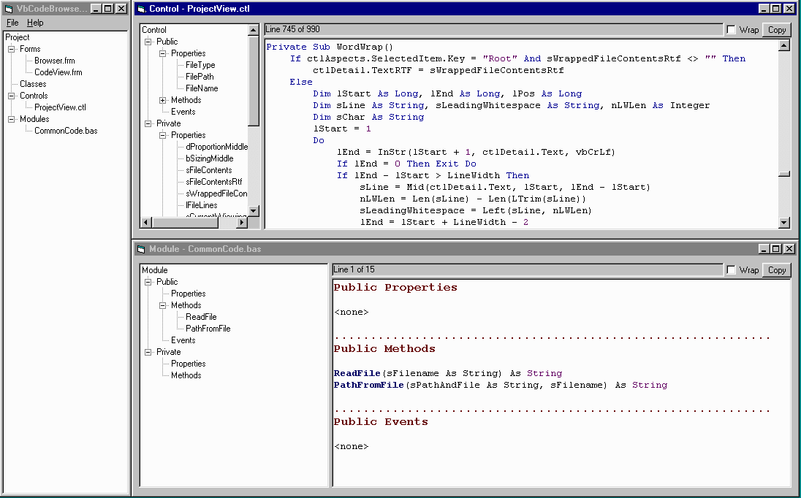



## VB Code Viewer \(parses, color\-codes, etc\.\)

### Description

This is an old utility I made a few years ago in VB 5. It can display the main project files in a .VBP and display the contents and a summary of what's in its code modules, color-coded.

It was designed to let any VB project be a reference for itself. To that end, it picks out any comments that appear immediately before a subroutine or function. And since its output is a RichEdit control, you can copy and paste anything it outputs into Word or some other editor for instant documentation.

While it's probably lacking a few reserved keywords and might be a little out of date, it's got a valuable core of logic to parse VB code and an algorithm to color-code VB stuff for a RichEdit control.

I welcome comments and improvements, so long as you give credit where it's due. Please vote for this code if you find it useful.
 
### More Info
 

             |
---                |---
**Submitted On**   |1998-03-26 14:06:00
**By**             |[James Vincent Carnicelli](https://github.com/Planet-Source-Code/PSCIndex/blob/master/ByAuthor/james-vincent-carnicelli.md)
**Level**          |Beginner
**User Rating**    |4.8 (24 globes from 5 users)
**Compatibility**  |VB 5\.0, VB 6\.0
**Category**       |[Complete Applications](https://github.com/Planet-Source-Code/PSCIndex/blob/master/ByCategory/complete-applications__1-27.md)
**World**          |[Visual Basic](https://github.com/Planet-Source-Code/PSCIndex/blob/master/ByWorld/visual-basic.md)
**Archive File**   |[CODE\_UPLOAD69116192000\.zip](https://github.com/Planet-Source-Code/james-vincent-carnicelli-vb-code-viewer-parses-color-codes-etc__1-9055/archive/master.zip)

